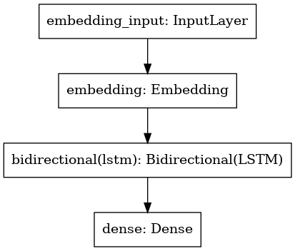
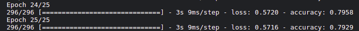
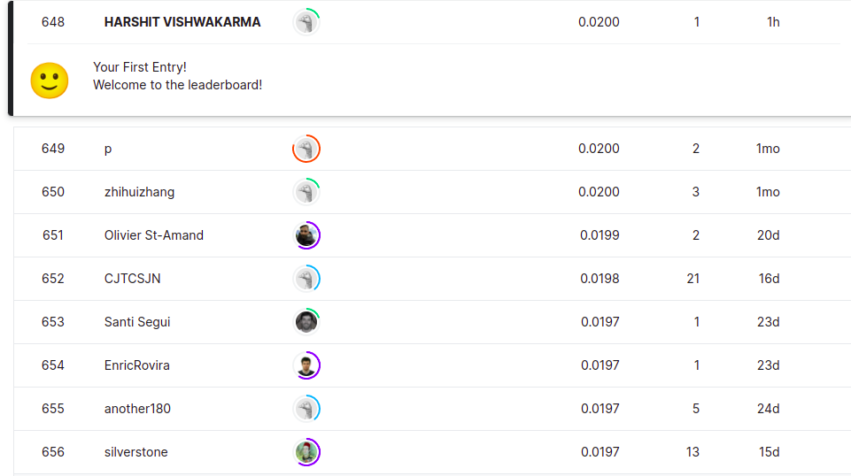

# Harshit (101917204) 3CSE8
## DA Assignment 1
Documentation for HousePrice Regression problem from preprocessing to model fitting [(Notebook Link)](https://www.kaggle.com/harshitvish/ds-eval1?scriptVersionId=90276723) [(Github Link)](https://github.com/Shikhar03Stark/DS_Lab_Eval)

## Steps followed
 1. Pre-processing

	 a. [Transaction to Temporal Dataset](#temporal-dataset)

	 b. [Text Vectorization](#text-vectorization)

	 c. [Sequence Padding](#sequence-padding)

     d. [N-grams](#n-gram)

 2. [Recommender Model](#recommender-model)

 3. [Validation Accuracy](#validation-accuracy)

 4. [Rank in Leaderboard](#rank-in-leaderboard)

---
### *Temporal Dataset*
The dataset was a transaction SQL-table with timestamp. I thought of Model that predicts next 100 words and tried to implement same in case of items. I converted ordered-data into sequential data grouped by customer_id to create buying history of each customer (analogus to document in corpus)

---
### *Text Vectorization*
I converted each document to a vector of int using keras.preprocessing.Tokenizer.

### *Text Vectorization*
I converted each document to a vector of int using keras.preprocessing.Tokenizer.

---
### *Sequence Padding*
I then padded the sequence vector to fixed length so as to use in embedding layer.

---
### *N-gram*
I then created N-gram dataset df[:-1] as input and df[-1] as output for training on LSTM model.

---
### *Recommender Model*
Recommender model consists of 
 - Embedding Layer (total_item -> 100)
 - Bi-LSTM (150 units)
 - Dense (One-hot output)

I used Adam optimizer and categorical cross-entropy loss function.

---
### *Validation Accuracy*
The LSTM model had close to 80% accuracy on the dataset of n-grams.

### *Rank in Leaderboard*
I was placed at **648** position.

MAP@12: *0.02*

Code: [Notebook Link](https://www.kaggle.com/harshitvish/ds-eval1?scriptVersionId=90276723)